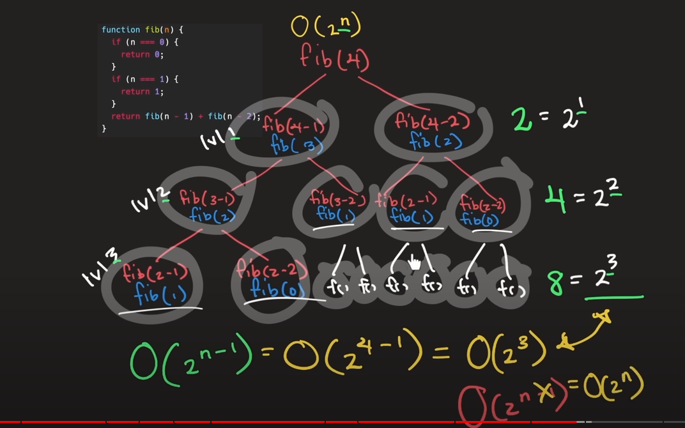

#What I found out today

######8/11/2023

1. I found out that multiplication is better than division in this tutorial in 2.28.34 timeStamp. This is answered and upvoted in [stackoverflow] (https://stackoverflow.com/questions/10535605/javascript-performance-divide-or-multiply-vs). |not tested|
The tutorial in 2.28.34 timeStamp also mentioned that when using for loop it is faster to use pre-incrementation(++i) than post-incrementation(I--)
2. I learn that there is a semi colon for every end of the line of a Javascript file, which is to tell the Javascript where the line ends. This doesn't related to the sucess of minifying Javascript file because the minifying tools |webpack, parcel, vite| will auto insert semi colon on each line before minifying code.
3. I learn that everyone has their own code style. |look at ESlint chapter in learnJavascript tomorrow|

######10/11/2023

1. I learn about big O notation in [freeCodeCamp] (https://youtu.be/Mo4vesaut8g?si=LzZP1XAvFJqoaH52). This is about analysing the effectiveness of our function if the input of the function is infinity (or the worst scenario of input ever).

2. In the [freeCodeCamp] (https://youtu.be/Mo4vesaut8g?si=LzZP1XAvFJqoaH52) they discussed about how sorting array by using midpoint (AKA binary search) has its time complexity of O(n log n), but I don't really understands how it occured yet eventhough I went through that part twice.

3. the same video also discuss about mergeSort function |function that seperate all the elements in the array into individual numbers, and compare the size of every two of them, and arrange the position of number| and how it is related to time complexity of O(n log n), but I don't really understands how it occured yet eventhough I went through that part twice.

4. the easiest to understand is the fibonacci function where it has the time complexity of O(2 n squared). the author of the video expanded the repetition of the function as in the picture below: 
. 

5. Haven't finish the space complexity portion of the video yet

######11/11/2023

1. going through the tutorial of [freeCodeCamp] (https://youtu.be/RBSGKlAvoiM?si=8PpU-nCl0Pwrg_wm). Learned about the existence of Static and Dynamic Array, which is new to me since I never encounter these terms while learning Array in Javascript. Turns out that Static Array has a fix size of Array which you can only put a certain number of element before it is full. for Dynamic Array you can insert as many element in the array you need which is just like the usual array in Javascript.

######13/11/2023

1. in the tutorial [MDN] (https://developer.mozilla.org/en-US/docs/Web/JavaScript/Memory_management) I learn the existent of memory allocation in Javascript. Turns out the reason that none of the tutorial I went through mentioned it because memory is automatically allocated or remove in Javascript. When you assign a value (create variable, array, object with values, createElement), Javascript will allocate memory for each of them. If the Javascript made a assumption that the memory is not needed, it will remove the memory (known as Garbage Collection)

There are multiple ways that Javascript determined when to remove the memory according to [Likenin] (https://www.linkedin.com/pulse/memory-management-javascript-understanding-fuzail-khan?trk=pulse-article_more-articles_related-content-card#:~:text=JavaScript%20is%20a%20high%2Dlevel,without%20worrying%20about%20memory%20allocation.)

It is a bit hard to understand them though, basically the same method has been describe in MDN, which is Mark-and-Sweep algorithm, where the Javascript will scan all the object |variable is not an object| and unreachable object |object with no reference that is object that no used in any function or anything else| will have their allocated memory removed. 

And there is another jargon which is "Memory Leak". This is the situation where those objects with no reference still have their allocation of memory. This could happen when object are referencing each other.

2. I found out the existent of Linked List in Javscript, never heard of it before in any Javascript videos until I am exploring data structure. going through this [tutorial] (https://youtu.be/TjeTc1f3ebY?si=xb_Wygzg35H6Lk5b)